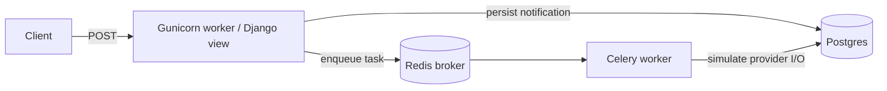

# Notification Service

A Django-based notification service built as an incremental system-design learning project. The repository starts from a simple synchronous API and evolves into an asynchronously processed delivery pipeline with Celery, Redis, and PostgreSQL, while keeping the implementation small enough to reason about clearly.

This project is intentionally practical rather than theoretical: each layer is implemented, exercised, and documented before moving on to the next one.

## Table of Contents

- Overview
- Stack
- Project structure
- Architecture (current state)
- What is implemented
- Key learnings
- API reference
- Quick start (local development)
- Development notes
- Roadmap
- Contributing
- License & contact

## Overview

The service exposes an HTTP API that accepts a notification request from one authenticated user and routes it toward another user. In the current implementation, the request is accepted quickly, persisted to PostgreSQL, and handed off to a background Celery task for simulated delivery.

The project is designed to explore production backend topics such as:

- reliable delivery and retries
- background processing and queueing
- request/response decoupling
- connection pooling and concurrency behavior
- observability and future migration paths such as Kafka

## Stack

- Django + Django REST Framework for the API layer
- Basic HTTP authentication for protected endpoints
- PostgreSQL with psycopg3 and native connection pooling for durable state
- Gunicorn as the WSGI server
- Celery + Redis for asynchronous task processing
- Locust for load testing and performance experimentation

## Project Structure

```text
notification_service/       # Django project package
├── celery.py                # Celery app configuration
├── settings.py
├── __init__.py              # imports celery_app so Celery loads on startup
api/                         # Notification logic, DB writes, Celery tasks
├── models.py                # Notification model with status field
├── serializers.py
├── tasks.py                 # send_notification_task
├── views.py                 # POST /api/v1/notify/ endpoint
users/                       # User model and auth-related app
```

There is no separate notifications app; the notification flow lives in the api app.

## Architecture (current state)

The current architecture moves the expensive delivery work out of the request path:



### Request flow

1. A client sends a notification request to the Django API.
2. The API validates the input, saves a notification record in PostgreSQL, and returns a fast response.
3. The same request enqueues a Celery task in Redis.
4. A separate Celery worker processes the task asynchronously and updates the notification status to sent or failed.

This decouples request acceptance from delivery work, which is a key step toward understanding queue-based systems.

## What is implemented

### Current status

- A protected POST endpoint at /api/v1/notify/ accepts notification payloads.
- Authentication is enforced with Basic Authentication.
- Notifications are persisted in PostgreSQL through the Django ORM.
- Each notification includes a status field with values: pending, sent, and failed.
- Delivery work is delegated to a Celery task rather than being executed inline in the request thread.
- Redis is used as the Celery broker; there is no Celery result backend by design.

### Notification model

The Notification model stores:

- source_user
- target_user
- created_date_time
- updated_date_time
- status

The database table is notifications_data.

### Celery task behavior

The task in api/tasks.py:

- is defined as a shared Celery task with retry support
- uses notification_id rather than passing ORM objects between processes
- simulates slow I/O with a short delay
- introduces a simulated failure rate to exercise retry behavior
- updates the database status to sent or failed after the attempt lifecycle

### Load testing approach

The project uses Locust to compare performance across increasing concurrency levels (for example 10, 50, and 100 concurrent users) before moving to the next architectural change.

## Key learnings

- Celery broker wiring matters: if notification_service/__init__.py does not import celery_app from celery.py, Celery may silently fall back to its default broker configuration and produce confusing connection errors.
- Inline synchronous work scales poorly because each request ties up a worker while the delivery logic runs.
- Async processing improves throughput and keeps the API response time relatively flat under load, even when the downstream work is slower.
- Retry behavior in Celery is subtle and exception-dependent, so the implementation must carefully handle exhaustion and logging.
- Under concurrent load, connection and pooling behavior can become a bottleneck, so tuning DB pool size and worker count is important.

## API reference

Base path: /api/v1/

### Notify endpoint

- Method: POST
- URL: /api/v1/notify/
- Auth: HTTP Basic Authentication with a valid Django user

Request body example:

```json
{
  "source_user": "alice",
  "target_user": "bob"
}
```

Success response:

- Status: 202 Accepted
- Body example:

```json
{
  "id": 1,
  "status": "queued"
}
```

Error responses:

- 400 Bad Request: invalid payload
- 401 Unauthorized: missing or invalid credentials
- 500 Internal Server Error: unexpected server error

Example curl:

```bash
curl -u demo:password -X POST \
  -H "Content-Type: application/json" \
  -d '{"source_user":"alice","target_user":"bob"}' \
  http://localhost:8000/api/v1/notify/
```

## Quick start (local development)

### Prerequisites

- Python 3.10+
- PostgreSQL
- Redis
- A virtual environment is recommended

### PostgreSQL setup

Create a database and role for local development:

```sql
CREATE USER my_new_user WITH PASSWORD 'my_secure_password';
CREATE DATABASE my_new_db OWNER my_new_user;
GRANT CONNECT ON DATABASE my_new_db TO my_new_user;
GRANT ALL PRIVILEGES ON SCHEMA public TO my_new_user;
ALTER DEFAULT PRIVILEGES IN SCHEMA public GRANT ALL PRIVILEGES ON TABLES TO my_new_user;
```

### Install and run locally

```bash
git clone <repo-url>
cd notification-service
python -m venv .venv
source .venv/bin/activate   # On Windows use: .venv\\Scripts\\activate
pip install -r requirements.txt
```

Set the required environment variables:

```bash
export DJANGO_SECRET_KEY="replace-me"
export DATABASE_NAME="db_name"
export DATABASE_USER="db_user_name"
export DATABASE_PASSWORD="db_password"
export DATABASE_HOST="localhost"
export DATABASE_PORT="5432"

export GUNICORN_WORKERS=4
export GUNICORN_BIND=0.0.0.0:8000
export GUNICORN_TIMEOUT=30
export GUNICORN_LOG_LEVEL=info
export GUNICORN_WORKER_CLASS=sync
```

Run database migrations:

```bash
python manage.py migrate
```

Create a user for Basic Auth testing:

```bash
python manage.py createsuperuser
```

Start Django:

```bash
python manage.py runserver
```

Start the Celery worker:

```bash
celery -A notification_service worker --loglevel=info
```

If you prefer Docker later, a compose-based setup can be added as part of the roadmap.

## Development notes

- The main endpoint is implemented in api/views.py and routed under api/v1/.
- The endpoint requires BasicAuthentication plus IsAuthenticated permissions.
- The Notification model lives in api/models.py and persists to the notifications_data table.
- Celery task wiring is configured via notification_service/celery.py and notification_service/__init__.py.
- The current implementation uses a simulated provider call and a small failure rate to exercise retries and status updates.

## Roadmap

Near-term ideas and planned extensions:

1. Add observability with centralized logs, metrics, and traces.
2. Compare Redis-backed Celery with Kafka as an alternative broker/streaming primitive.
3. Tune Celery worker concurrency and pool strategies for higher throughput.
4. Add self-healing or periodic recovery for notifications that never reach the queue.
5. Introduce circuit breakers, idempotency, and richer delivery channel support.
6. Add Docker and docker-compose support for local development.

## Contributing

Contributions are welcome. A simple workflow is:

1. Create a branch named feature/xxx or fix/xxx from the current development branch.
2. Add or update tests for your change.
3. Run python manage.py test and confirm the behavior.
4. Open a pull request with a clear summary.

## License & contact

This project is currently maintained as an educational repository. If you want to use or extend it, feel free to open an issue or pull request.

Author / maintainer: BrownMunda1

---

Small, focused, and extensible — this repository is intentionally minimal so you can iterate quickly while learning system design best practices.
