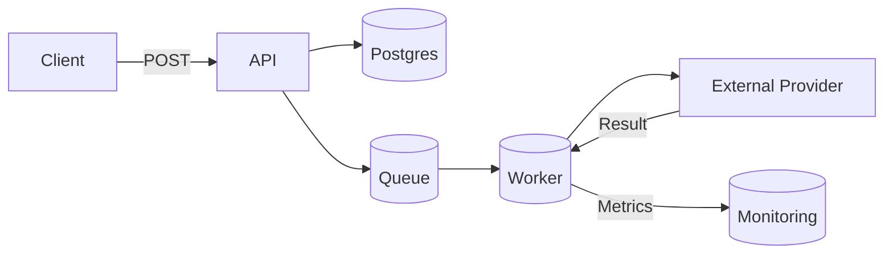

# notification-service

A Django WSGI-based notification service — a learning project for system design.

This repository contains a minimal, production-minded notification service built with Django and Django REST Framework. The project started as an educational MVP (save a notification between two users in Postgres) and will evolve into a resilient notification delivery system with retries, circuit breakers, observability and robust error handling.

Table of Contents
- Overview
- Current status (MVP)
- Final vision
- Features (current & planned)
- Architecture overview
- API reference
- Quick start (local)
- Development notes
- Roadmap
- Contributing
- License & Contact

Overview
--------

This service provides an HTTP API to publish notifications from a source user to a target user. It's designed as a focused, extensible playground to learn and demonstrate system design concepts such as: reliable delivery, retry strategies, circuit breakers, background processing, queuing, observability, and graceful error handling.

Current status (MVP)
---------------------

- Simple POST API that accepts a notification payload and persists it to a PostgreSQL database.
- Authentication: Basic HTTP authentication is enforced on the endpoint.
- Data model: `Notification` with `source_user`, `target_user`, plus created/updated timestamps.
- Endpoint available at: `/api/v1/notify/` (see API Reference below).

The project intentionally keeps the MVP tiny so the core learning goals (retries, circuit breakers, workers, metrics) can be added iteratively.

Final vision
------------

The final system will be a production-ready notification delivery platform implementing:

- Reliable delivery with configurable retry/backoff policies (exponential backoff).
- Circuit breaker to protect downstream systems (e.g., SMTP providers, external push APIs).
- Background workers for delivery (Celery / RQ) and durable queues (Redis / RabbitMQ).
- Idempotency and deduplication to avoid duplicate deliveries.
- Dead-letter queue for failed messages that need manual inspection.
- Observability: metrics, tracing and structured logs (Prometheus, Grafana, OpenTelemetry).
- Extensible delivery channels (email, SMS, push notifications, webhooks).
- Horizontal scalability and containerization (Docker, Kubernetes) for high availability.

Features
--------

Current (MVP):
- Persist notifications to Postgres via Django ORM.
- Authenticated POST endpoint.

Planned:
- Background workers for delivery and retry logic.
- Circuit breaker middleware for external calls.
- Delivery channel plugins (email/SMS/push/webhook).
- Monitoring, alerting, and dashboards.

Architecture overview
---------------------

High-level flow (final state):



In the MVP the API writes directly to Postgres; later we will publish to a durable queue and let workers handle delivery and retries.

API reference (MVP)
-------------------

Base path: `/api/v1/`

Notify endpoint
- URL: `POST /api/v1/notify/`
- Auth: HTTP Basic Authentication (provide a valid Django user)
- Request JSON body (example):

```json
{
	"source_user": "alice",
	"target_user": "bob"
}
```

- Success response: HTTP 201 Created with the created notification JSON (fields: `id`, `source_user`, `target_user`, `created_date_time`, `updated_date_time`).
- Error responses:
	- 400 Bad Request: invalid payload
	- 401 Unauthorized: missing/invalid credentials
	- 500 Internal Server Error: unexpected server error

Example curl (replace credentials):

```bash
curl -u demo:password -X POST \
	-H "Content-Type: application/json" \
	-d '{"source_user":"alice","target_user":"bob"}' \
	http://localhost:8000/api/v1/notify/
```

Data model (MVP)
- Table: `notifications_data`
- Fields: `id`, `sourceUser` (source_user), `targetUser` (target_user), `createdDateTime`, `updatedDateTime`.

Quick start (local development)
-------------------------------

Prerequisites
- Python 3.10+ (a virtual environment is recommended)
- PostgreSQL (or adapt settings to SQLite for quick local runs)

Install & run locally

PostgreSQL Setup:
```text
CREATE USER my_new_user WITH PASSWORD 'my_secure_password';
CREATE DATABASE my_new_db OWNER my_new_user;
-- Allow the user to connect to the database
GRANT CONNECT ON DATABASE my_new_db TO my_new_user;

-- Allow the user to create new tables, views, and modify the 'public' schema
GRANT ALL PRIVILEGES ON SCHEMA public TO my_new_user;

-- Ensure any future tables created in this schema are also manageable by this user
ALTER DEFAULT PRIVILEGES IN SCHEMA public GRANT ALL PRIVILEGES ON TABLES TO my_new_user;

```

```bash
git clone <repo-url>
cd notification-service
python -m venv .venv
source .venv/bin/activate   # On Windows use: .venv\\Scripts\\activate
pip install -r requirements.txt

# Configure env vars (example):
export DJANGO_SECRET_KEY="replace-me"
export DATABASE_NAME="db_name"
export DATABASE_USER="db_user_name (owner or superuser)"
export DATABASE_PASSWORD="db_password"
export DATABASE_HOST="localhost"
export DATABASE_PORT="5432"

export GUNICORN_WORKERS=4
export GUNICORN_BIND=0.0.0.0:8000
export GUNICORN_TIMEOUT=30
export GUNICORN_LOG_LEVEL=info
export GUNICORN_WORKER_CLASS=sync

python manage.py migrate
python manage.py createsuperuser  # create a user for BasicAuth testing
python manage.py runserver
```

If you prefer Docker, add a `docker-compose.yml` that includes Postgres and Redis, then run migrations and start the Django container. (A compose file is planned in the roadmap.)

Development notes
-----------------

- Endpoint is implemented at `api.views.notify` and routed under `api/v1/` (see `notification_service/urls.py`).
- The endpoint requires BasicAuthentication and `IsAuthenticated` permission.
- The `Notification` model lives in `api.models` and persists to table `notifications_data`.

Roadmap (high level)
---------------------

1. Add background worker (Celery) + Redis queue for deliveries.
2. Implement retry policies (exponential backoff) and persistence of retry attempts.
3. Add a circuit breaker around external delivery providers.
4. Implement idempotency keys and deduplication.
5. Add monitoring and tracing (Prometheus + OpenTelemetry).
6. Dockerize services and provide `docker-compose.yml` for local dev.

Contributing
------------

Contributions are welcome. Suggested workflow:

1. Create a branch named `feature/xxx` or `fix/xxx` from `mvp1`.
2. Add tests that cover your changes.
3. Run `python manage.py test` and ensure all tests pass.
4. Open a pull request with a clear description of the change.

When you update the project, please also update this README:
- Update "Current status" and "API reference" sections when the API changes.
- Add short entries to the top-level changelog (date + summary).

License & contact
-----------------

This project is MIT-licensed (add a LICENSE file to set this explicitly).

Author / Maintainer: BrownMunda1

Need help updating the README after code changes? Ask for an updated README and include what changed (files, endpoints, or architecture). I will keep the README in sync.

----
Small, focused, and extensible — this repository is intentionally minimal so you can iterate quickly while learning system design best practices.
